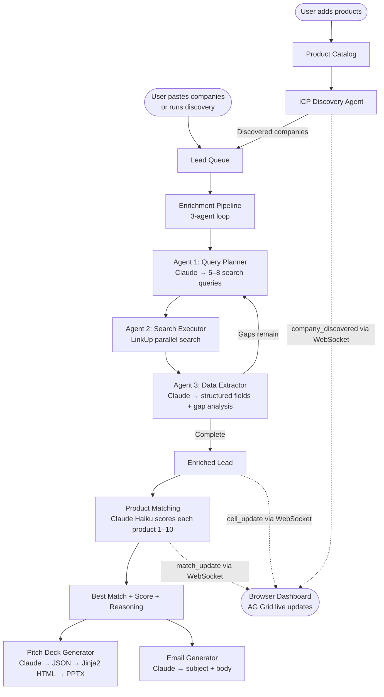
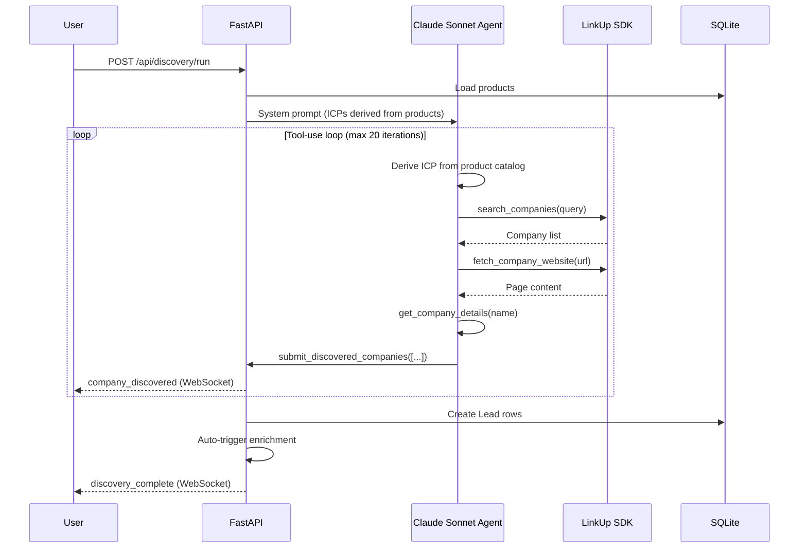
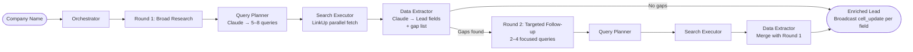
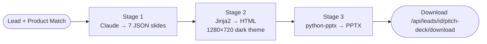

# Stick — Architecture

An AI sales agent that takes a product catalog, discovers target companies, enriches them with deep web research, matches the best product to each company, and generates personalized pitch decks + outreach emails.

## Stack

| Layer | Technology |
|-------|-----------|
| Backend | Python 3.12 + FastAPI (managed by `uv`) |
| Frontend | Next.js + TypeScript + AG Grid (managed by `bun`) |
| Database | SQLite via SQLModel |
| Realtime | WebSocket (cell-level streaming) |
| AI | Claude Sonnet / Haiku (reasoning, extraction, generation) |
| Search | LinkUp SDK (web research) |
| Billing | Stripe (usage-based credits) |

---

## System Flow

End-to-end journey from product catalog to personalized pitch deck.



---

## Discovery Agent Flow

The ICP discovery agent is a Claude Sonnet tool-use loop that autonomously finds companies matching your product catalog. It has four tools and runs for up to 20 iterations.



---

## Enrichment Pipeline (Multi-Agent)

Three agents run per lead, with an optional follow-up round if gaps remain.



---

## Pitch Deck Generation

Three-stage pipeline producing a downloadable PPTX.



Slide structure: Title → Company Snapshot → Challenge → Solution → Product Fit → Proof → CTA.

---

## Directory Structure

```
hack-europe/
├── backend/
│   ├── main.py                      # FastAPI app, CORS, all routes, WebSocket manager
│   ├── config.py                    # Pydantic settings from .env
│   ├── models.py                    # SQLModel schemas (Lead, Product, ProductMatch, PitchDeck)
│   ├── db.py                        # Async SQLite engine + session factory
│   ├── auth.py                      # JWT auth (register, login, token verification)
│   ├── analytics.py                 # SQL aggregations + Claude conversion predictions
│   ├── billing.py                   # Stripe credits + metering
│   ├── enrichment/
│   │   ├── linkup_search.py         # LinkUp client singleton
│   │   ├── pipeline.py              # Multi-agent orchestrator (iterative follow-up)
│   │   └── agents/
│   │       ├── query_planner.py     # Agent 1: Claude → search queries
│   │       ├── search_executor.py   # Agent 2: LinkUp parallel search
│   │       └── data_extractor.py    # Agent 3: Claude → structured Lead fields + gaps
│   ├── discovery/
│   │   ├── prompts.py               # ICP system prompt builder
│   │   ├── icp_agent.py             # Claude Sonnet tool-use agent (4 tools)
│   │   └── discovery_pipeline.py    # Orchestrator: products → agent → leads → enrich
│   ├── matching/
│   │   └── pipeline.py              # Claude scores all products against each lead
│   ├── actions/
│   │   ├── pitch_deck.py            # Claude → JSON → Jinja2 → PPTX
│   │   └── email_generator.py       # Personalized outreach email
│   └── tests/                       # 60+ unit tests
├── prompts/                         # Prompt modules (imported by backend with inline fallbacks)
│   ├── query_planner_prompt.py
│   ├── extraction_prompt.py
│   ├── discovery_prompt.py
│   ├── matching_prompt.py
│   ├── pitch_deck_prompt.py
│   └── email_prompt.py
├── frontend/                        # Next.js app (AG Grid dashboard, pitch viewer, analytics)
├── templates/
│   └── pitch_deck.html              # Jinja2 slide template (dark, 16:9)
├── generated/pitchdecks/            # Saved PPTX files
└── docs/
    └── architecture.md              # This file
```

---

## API Reference

### Auth
```
POST   /api/auth/register       Register new user
POST   /api/auth/login          Login → JWT token
GET    /api/auth/me             Current user info
```

### Products
```
POST   /api/products            Bulk import product catalog
GET    /api/products            List all products
GET    /api/products/{id}       Single product detail
PUT    /api/products/{id}       Update a product
DELETE /api/products/{id}       Remove a product
```

### Discovery
```
POST   /api/discovery/run       ICP agent: find companies matching product catalog
```

### Leads
```
POST   /api/leads/import        Import company names → creates leads + fires enrichment
GET    /api/leads               List all leads with enrichment data
GET    /api/leads/{id}          Single lead detail
POST   /api/leads/{id}/enrich   Re-trigger enrichment for one lead
```

### Matching
```
POST   /api/matches/generate    AI matching: all enriched leads × all products
GET    /api/matches             List matches (filter by lead_id or product_id)
```

### Actions
```
POST   /api/leads/{id}/pitch-deck?product_id=X    Generate pitch deck
GET    /api/leads/{id}/pitch-deck                  Get existing deck
GET    /api/leads/{id}/pitch-deck/download         Download PPTX
POST   /api/leads/{id}/email?product_id=X          Generate outreach email
```

### Analytics & Billing
```
GET    /api/analytics           Aggregate analytics dashboard
POST   /api/analytics/predict   Claude conversion predictions
POST   /api/billing/checkout    Stripe checkout session
GET    /api/billing/credits     Remaining credits
```

### WebSocket
```
WS     /ws/updates              Real-time updates (all event types below)
```

---

## WebSocket Events

```json
// Discovery
{"type": "discovery_start",     "product_count": 2, "max_companies": 20}
{"type": "discovery_thinking",  "iteration": 1, "detail": "Calling search_companies: ..."}
{"type": "company_discovered",  "lead_id": 5, "company_name": "Acme Corp", "why_good_fit": "..."}
{"type": "discovery_complete",  "companies_found": 15, "lead_ids": [5, 6, 7]}
{"type": "discovery_error",     "error": "No products found"}

// Enrichment
{"type": "enrichment_start",    "lead_id": 1, "company_name": "Stripe"}
{"type": "agent_thinking",      "lead_id": 1, "round": 1, "action": "planning_queries", "detail": "..."}
{"type": "cell_update",         "lead_id": 1, "field": "funding", "value": "Series B, $45M"}
{"type": "enrichment_complete", "lead_id": 1, "company_name": "Stripe", "rounds": 2}
{"type": "enrichment_error",    "lead_id": 1, "error": "..."}

// Matching
{"type": "matching_start",      "total_leads": 5, "total_products": 3}
{"type": "match_update",        "lead_id": 1, "product_id": 2, "match_score": 8.5, "match_reasoning": "..."}
{"type": "matching_complete"}

// Predictions
{"type": "prediction_update",   "lead_id": 1, "product_id": 2, "conversion_likelihood": "high"}
```
