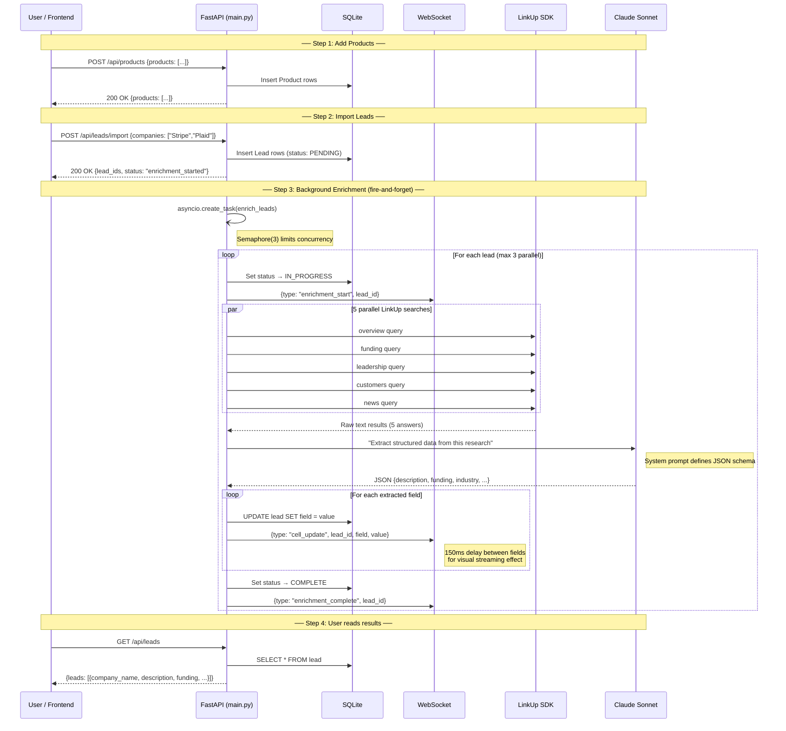
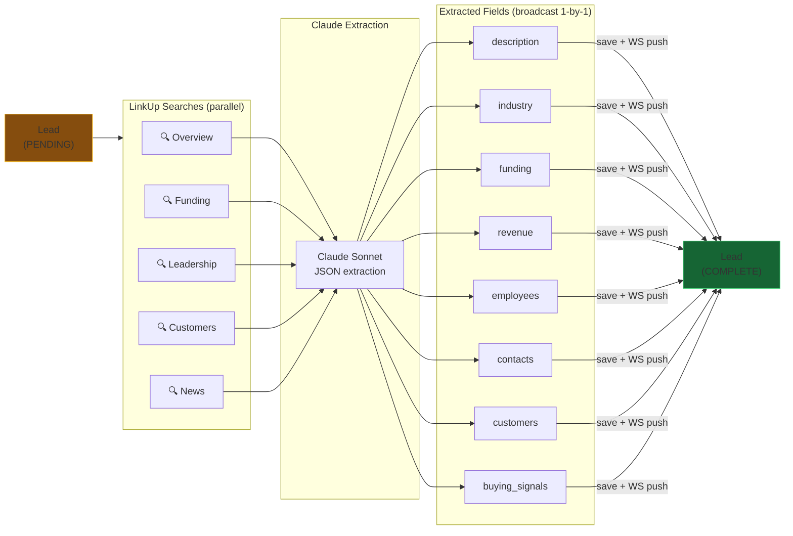

# SalesForge — Architecture Overview

## What We're Building
An AI sales agent that takes a catalog of products and a list of target companies, enriches the companies with deep web research, uses AI to match the best product(s) to each company, and generates personalized pitch decks + outreach emails per match. **Cheaper, specialized Claygent.**

## Stack
```
Backend:  Python 3.12 + FastAPI (managed by uv)
Frontend: Next.js + TypeScript + AG Grid (managed by bun)
DB:       SQLite via SQLModel
Realtime: WebSocket (enrichment + matching streams live to cells)
AI:       Claude (reasoning/generation) + ElevenLabs (voice briefings)
Search:   LinkUp SDK (web research)
Billing:  Stripe (usage-based)
```

## Directory Structure
```
hack-europe/
├── backend/                         # Person A
│   ├── main.py                      # FastAPI app, CORS, route registration
│   ├── config.py                    # Settings from env vars
│   ├── models.py                    # SQLModel schemas (Lead, Product, ProductMatch, PitchDeck, etc.)
│   ├── db.py                        # SQLite init + session
│   ├── enrichment/
│   │   ├── linkup_search.py         # LinkUp SDK wrapper
│   │   ├── claude_enricher.py       # Claude structured extraction
│   │   └── pipeline.py              # Orchestrates enrichment per lead
│   ├── actions/
│   │   ├── pitch_deck.py            # Claude → JSON slides → HTML + PPTX
│   │   ├── email_generator.py       # Personalized outreach emails
│   │   └── voice_summary.py         # ElevenLabs call-prep briefing (Phase 3)
│   ├── billing/
│   │   └── stripe_billing.py        # Stripe Checkout + metered usage (Phase 3)
│   └── agent/
│       └── orchestrator.py          # Claude tool-use agentic loop (Phase 2)
├── prompts/                         # Person B
│   ├── linkup_queries.py            # Optimized LinkUp query templates
│   ├── claude_prompts.py            # Claude system prompts for each step
│   ├── pitch_deck_prompt.py         # The pitch deck generation prompt
│   └── test_prompts.py              # Test harness: run N companies, score quality
├── frontend/                        # Person C + D
│   ├── package.json
│   ├── app/
│   │   ├── page.tsx                 # Main spreadsheet view
│   │   └── layout.tsx               # App shell
│   ├── components/
│   │   ├── SpreadsheetGrid.tsx      # AG Grid with enrichment + match columns
│   │   ├── ActionPanel.tsx          # Side panel: deck, email, voice (product-aware)
│   │   ├── LeadImport.tsx           # CSV paste input
│   │   ├── ProductCatalog.tsx       # Multi-product input form (add/edit/remove products)
│   │   ├── PitchDeckViewer.tsx      # HTML slide viewer + PPTX download
│   │   └── AgentThinking.tsx        # Agent reasoning display (Phase 3)
│   └── lib/
│       └── api.ts                   # Backend API client + WebSocket
├── templates/
│   └── pitch_deck.html              # Jinja2 slide template
├── docs/                            # Coordination
│   ├── architecture.md              # This file
│   ├── backend-tracker.md           # Person A progress
│   ├── linkup-prompts-tracker.md    # Person B progress
│   └── frontend-pitch-tracker.md    # Person C+D progress
├── pyproject.toml
└── .env.example
```

## Phase 1 — What's Built Now

This is the current working system. Everything below is **implemented and tested**.



## Full System — Phase 1 through 3

This shows the complete planned pipeline. Boxes marked with checkmarks are built.

```mermaid
flowchart TB
    subgraph INPUT["📥 User Input"]
        P[Add Products to Catalog]
        L[Paste Company Names]
    end

    subgraph PHASE1["Phase 1 — Enrichment ✅ BUILT"]
        direction TB
        DB_W1[(SQLite)]
        ENRICH["Enrichment Pipeline<br/>(pipeline.py)"]
        LINKUP["LinkUp SDK<br/>5 parallel searches/company<br/>(linkup_search.py)"]
        CLAUDE_E["Claude Sonnet<br/>Structured extraction<br/>(claude_enricher.py)"]
        WS1["WebSocket<br/>cell_update events"]
    end

    subgraph PHASE2["Phase 2 — Matching + Actions 🔜 NEXT"]
        direction TB
        MATCH["Product Matching<br/>Claude scores Lead × Product"]
        PREDICT["Conversion Prediction<br/>Claude identifies patterns"]
        DECK["Pitch Deck Generator<br/>Claude → JSON → HTML/PPTX"]
        EMAIL["Email Generator<br/>Personalized outreach"]
        AGENT["Agent Orchestrator<br/>Claude tool-use loop"]
        WS2["WebSocket<br/>match_update events"]
    end

    subgraph PHASE3["Phase 3 — Integrations 🔮 LATER"]
        VOICE["ElevenLabs<br/>Voice briefing"]
        STRIPE["Stripe<br/>Usage-based billing"]
        ANALYTICS["Analytics Dashboard<br/>Industry breakdown, signals"]
    end

    subgraph OUTPUT["📤 Output"]
        GRID["AG Grid Spreadsheet<br/>Live-updating cells"]
        PANEL["Action Panel<br/>Deck + Email + Voice"]
    end

    P --> DB_W1
    L --> DB_W1
    DB_W1 --> ENRICH
    ENRICH --> LINKUP
    LINKUP --> CLAUDE_E
    CLAUDE_E --> DB_W1
    CLAUDE_E --> WS1
    WS1 --> GRID

    DB_W1 --> MATCH
    MATCH --> PREDICT
    MATCH --> WS2
    WS2 --> GRID
    MATCH --> DECK
    MATCH --> EMAIL
    AGENT -.->|"calls as tools"| MATCH
    AGENT -.->|"calls as tools"| DECK
    AGENT -.->|"calls as tools"| EMAIL

    DECK --> PANEL
    EMAIL --> PANEL
    VOICE --> PANEL
    STRIPE -.->|"meters all actions"| PHASE2
    ANALYTICS --> GRID

    style PHASE1 fill:#1a3a1a,stroke:#4ade80,stroke-width:2px
    style PHASE2 fill:#1a2a3a,stroke:#60a5fa,stroke-width:2px
    style PHASE3 fill:#2a1a2a,stroke:#c084fc,stroke-width:2px
```



## Enrichment Pipeline Detail

How a single lead gets enriched — this is the core loop running today.



## Agent Orchestrator — Phase 2 Design (not built yet)

This is the planned agentic loop for the "Agentic AI" prize. **Tell me what you want changed.**

```mermaid
flowchart TB
    USER["User request<br/>'Research and pitch Stripe'"] --> AGENT

    subgraph AGENT["Agent Orchestrator (Claude tool-use loop)"]
        THINK["Claude decides<br/>which tool to call next"]
        THINK -->|"tool_use"| TOOLS
        TOOLS -->|"result"| THINK
        THINK -->|"no more tools"| DONE["Return final answer"]
    end

    subgraph TOOLS["Available Tools"]
        T1["search_web(query)<br/>→ LinkUp"]
        T2["analyze_company(lead_id)<br/>→ Enrichment pipeline"]
        T3["match_products(lead_id)<br/>→ Score all products"]
        T4["generate_pitch_deck(lead_id, product_id)<br/>→ HTML/PPTX slides"]
        T5["draft_email(lead_id, product_id)<br/>→ Outreach email"]
        T6["re_evaluate(lead_id, new_info)<br/>→ Update analysis"]
    end

    THINK -.->|"Step 1"| T2
    THINK -.->|"Step 2"| T3
    THINK -.->|"Step 3"| T4
    THINK -.->|"Step 4"| T5

    style AGENT fill:#1a2a3a,stroke:#60a5fa,stroke-width:2px
    style TOOLS fill:#1a1a2a,stroke:#a78bfa
```



## API Contract (for frontend ↔ backend coordination)

### Endpoints
```
POST   /api/products              # Bulk import product catalog
GET    /api/products              # List all products
GET    /api/products/{id}         # Single product detail
PUT    /api/products/{id}         # Update a product
DELETE /api/products/{id}         # Remove a product
POST   /api/leads/import          # Import CSV of companies
GET    /api/leads                 # List all leads with enrichment data
GET    /api/leads/{id}            # Single lead detail
POST   /api/leads/{id}/enrich     # Trigger enrichment for one lead
POST   /api/matches/generate      # Trigger AI matching (all leads × all products)
GET    /api/matches               # List all product-lead matches with scores
GET    /api/matches?lead_id=X     # Matches for a specific lead
GET    /api/matches?product_id=X  # Matches for a specific product
POST   /api/leads/{id}/pitch-deck?product_id=X  # Generate pitch deck for product-lead pair
GET    /api/leads/{id}/pitch-deck  # Get generated deck (HTML)
GET    /api/leads/{id}/pitch-deck/download  # Download PPTX
POST   /api/leads/{id}/email?product_id=X  # Generate outreach email for product-lead pair
POST   /api/leads/{id}/voice      # Generate voice briefing [Phase 3]
GET    /api/analytics              # Aggregate analytics across all leads
POST   /api/analytics/predict     # Run Claude conversion prediction on all matches
POST   /api/billing/checkout      # Stripe checkout session [Phase 3]
GET    /api/billing/credits       # Remaining credits [Phase 3]
WS     /ws/updates                # Real-time cell + match updates
```

### WebSocket Message Format
```json
{
  "type": "cell_update",
  "lead_id": "abc123",
  "field": "funding",
  "value": "Series B, $45M (2024)",
  "status": "complete"
}
```

Match update:
```json
{
  "type": "match_update",
  "lead_id": "abc123",
  "product_id": "prod456",
  "match_score": 8.5,
  "match_reasoning": "Strong alignment because...",
  "product_name": "SalesForge Pro"
}
```

Prediction update:
```json
{
  "type": "prediction_update",
  "lead_id": "abc123",
  "product_id": "prod456",
  "conversion_likelihood": "high",
  "conversion_reasoning": "Similar profile to known converters: recent funding + fintech + 50-200 employees"
}
```

### Lead Schema (what the frontend renders)
```json
{
  "id": "abc123",
  "company_name": "Acme Corp",
  "url": "https://acme.com",
  "description": "200-word AI-generated summary...",
  "funding": "Series B, $45M (Jan 2024)",
  "industry": "FinTech",
  "revenue": "$12M ARR",
  "employees": 150,
  "contacts": [
    {"name": "Jane Doe", "role": "CEO", "linkedin": "https://linkedin.com/in/janedoe"}
  ],
  "customers": ["Stripe", "Plaid", "Revolut"],
  "buying_signals": [
    {"signal_type": "recent_funding", "description": "Raised $45M Series B in Jan 2024", "strength": "strong"},
    {"signal_type": "hiring_surge", "description": "Headcount grew 40% in 6 months", "strength": "moderate"}
  ],
  "enrichment_status": "complete",
  "matched_products": [
    {
      "product_id": "prod456",
      "product_name": "SalesForge Pro",
      "match_score": 8.5,
      "match_reasoning": "Strong alignment because...",
      "conversion_likelihood": "high",
      "conversion_reasoning": "Similar profile to known converters..."
    }
  ],
  "pitch_deck_generated": false,
  "email_generated": false
}
```

## Prize Strategy
| Prize | How We Win It | Phase |
|-------|--------------|-------|
| Agentic AI Track (€1k) | Agent autonomously researches, matches products, generates decks | 2 |
| Best Use of Data (€7k) | LinkUp raw data → structured insight + buying signals + product matching + conversion prediction + analytics dashboard + pitch decks | 1-2 |
| Best Use of Claude ($10k credits) | Core reasoning engine: extraction, matching, deck generation, tool-use | 1-2 |
| Best Stripe Integration (€3k) | Usage-based billing, pay-per-enrichment/deck | 3 |
| Autonomous Consulting Agent | Acts like a senior SDR/consultant, recommends which product to pitch | 2 |
| Best Use of ElevenLabs (AirPods) | Voice call-prep briefing per lead | 3 |
