```mermaid
flowchart TB
    USER["User request<br/>'Research and pitch Stripe'"] --> AGENT

    subgraph AGENT["Agent Orchestrator (Claude tool-use loop)"]
        THINK["Claude decides<br/>which tool to call next"]
        THINK -->|"tool_use"| TOOLS
        TOOLS -->|"result"| THINK
        THINK -->|"no more tools"| DONE["Return final answer"]
    end

    subgraph TOOLS["Available Tools"]
        T1["search_web(query)<br/>→ LinkUp"]
        T2["analyze_company(lead_id)<br/>→ Enrichment pipeline"]
        T3["match_products(lead_id)<br/>→ Score all products"]
        T4["generate_pitch_deck(lead_id, product_id)<br/>→ HTML/PPTX slides"]
        T5["draft_email(lead_id, product_id)<br/>→ Outreach email"]
        T6["re_evaluate(lead_id, new_info)<br/>→ Update analysis"]
    end

    THINK -.->|"Step 1"| T2
    THINK -.->|"Step 2"| T3
    THINK -.->|"Step 3"| T4
    THINK -.->|"Step 4"| T5

    style AGENT fill:#1a2a3a,stroke:#60a5fa,stroke-width:2px
    style TOOLS fill:#1a1a2a,stroke:#a78bfa
```

# SalesForge — Architecture Overview

## What We're Building
An AI sales agent that takes a catalog of products and a list of target companies, enriches the companies with deep web research, uses AI to match the best product(s) to each company, and generates personalized pitch decks + outreach emails per match. **Cheaper, specialized Claygent.**

## Stack
```
Backend:  Python 3.12 + FastAPI (managed by uv)
Frontend: Next.js + TypeScript + AG Grid (managed by bun)
DB:       SQLite via SQLModel
Realtime: WebSocket (enrichment + matching streams live to cells)
AI:       Claude (reasoning/generation) + ElevenLabs (voice briefings)
Search:   LinkUp SDK (web research)
Billing:  Stripe (usage-based)
```

## Directory Structure
```
hack-europe/
├── backend/                         # Person A
│   ├── main.py                      # FastAPI app, CORS, route registration
│   ├── config.py                    # Settings from env vars
│   ├── models.py                    # SQLModel schemas (Lead, Product, ProductMatch, PitchDeck, etc.)
│   ├── db.py                        # SQLite init + session
│   ├── enrichment/
│   │   ├── linkup_search.py         # LinkUp client singleton
│   │   ├── pipeline.py              # Multi-agent orchestrator with iterative follow-up
│   │   └── agents/
│   │       ├── query_planner.py     # Agent 1: Claude → tailored search queries
│   │       ├── search_executor.py   # Agent 2: LinkUp parallel search (no Claude)
│   │       └── data_extractor.py    # Agent 3: Claude → structured Lead fields + gap analysis
│   ├── actions/
│   │   ├── pitch_deck.py            # Claude → JSON slides → HTML + PPTX
│   │   ├── email_generator.py       # Personalized outreach emails
│   │   └── voice_summary.py         # ElevenLabs call-prep briefing
│   ├── billing/
│   │   └── stripe_billing.py        # Stripe Checkout + metered usage
│   └── agent/
│       └── orchestrator.py          # Claude tool-use agentic loop
├── prompts/                         # Person B
│   ├── linkup_queries.py            # Optimized LinkUp query templates
│   ├── claude_prompts.py            # Claude system prompts for each step
│   ├── query_planner_prompt.py      # Query planner agent prompt
│   ├── extraction_prompt.py         # Data extractor agent prompt
│   ├── pitch_deck_prompt.py         # The pitch deck generation prompt
│   └── test_prompts.py              # Test harness: run N companies, score quality
├── frontend/                        # Person C + D
│   ├── package.json
│   ├── app/
│   │   ├── page.tsx                 # Main spreadsheet view
│   │   └── layout.tsx               # App shell
│   ├── components/
│   │   ├── SpreadsheetGrid.tsx      # AG Grid with enrichment + match columns
│   │   ├── ActionPanel.tsx          # Side panel: deck, email, voice (product-aware)
│   │   ├── LeadImport.tsx           # CSV paste input
│   │   ├── ProductCatalog.tsx       # Multi-product input form (add/edit/remove products)
│   │   ├── PitchDeckViewer.tsx      # HTML slide viewer + PPTX download
│   │   └── AgentThinking.tsx        # Agent reasoning display
│   └── lib/
│       └── api.ts                   # Backend API client + WebSocket
├── templates/
│   └── pitch_deck.html              # Jinja2 slide template
├── docs/                            # Coordination
│   ├── architecture.md              # This file
│   ├── backend-tracker.md           # Person A progress
│   ├── linkup-prompts-tracker.md    # Person B progress
│   └── frontend-pitch-tracker.md    # Person C+D progress
├── pyproject.toml
└── .env.example
```

## Multi-Agent Enrichment Pipeline

This is the core of the system. Each "agent" is an async Python function — no frameworks, just Claude SDK + LinkUp SDK + a `while` loop.

```mermaid
sequenceDiagram
    participant U as User / Frontend
    participant API as FastAPI (main.py)
    participant DB as SQLite
    participant WS as WebSocket
    participant QP as Agent 1: Query Planner
    participant SE as Agent 2: Search Executor
    participant DE as Agent 3: Data Extractor
    participant CL as Claude
    participant LU as LinkUp SDK

    Note over U,LU: ── Step 1: Add Products ──
    U->>API: POST /api/products {products: [...]}
    API->>DB: Insert Product rows
    API-->>U: 200 OK

    Note over U,LU: ── Step 2: Import Leads ──
    U->>API: POST /api/leads/import {companies: ["Stripe","Plaid"]}
    API->>DB: Insert Lead rows (status: PENDING)
    API-->>U: 200 OK {lead_ids, status: "enrichment_started"}

    Note over U,LU: ── Step 3: Multi-Agent Enrichment (fire-and-forget) ──
    API-)API: asyncio.create_task(enrich_leads)
    Note right of API: Semaphore(3) limits concurrency

    loop For each lead (max 3 parallel)
        API->>DB: Set status → IN_PROGRESS
        API->>WS: {type: "enrichment_start", lead_id}

        rect rgb(30, 50, 30)
            Note over QP,LU: Round 1 — Broad Research
            API->>WS: agent_thinking: "planning_queries"
            API->>QP: plan_queries(company_name)
            QP->>CL: "Generate 5-8 search queries for Stripe"
            CL-->>QP: SearchPlan (6 queries with target_fields)

            API->>WS: agent_thinking: "executing_searches"
            API->>SE: execute_searches(plan)
            par 6 parallel LinkUp searches
                SE->>LU: sourcedAnswer queries
                SE->>LU: structured queries (contacts/customers)
            end
            LU-->>SE: SearchResults[]

            API->>WS: agent_thinking: "extracting_data"
            API->>DE: extract_lead_data(company, results)
            DE->>CL: "Extract structured data + assess gaps"
            CL-->>DE: ExtractionResult {data, confidences, gaps, hints}
        end

        loop For each extracted field
            API->>DB: UPDATE lead SET field = value
            API->>WS: {type: "cell_update", lead_id, field, value}
        end

        alt Gaps in important fields AND round < 2
            API->>WS: agent_thinking: "follow_up_needed"
            rect rgb(50, 30, 30)
                Note over QP,LU: Round 2 — Targeted Follow-up
                API->>QP: plan_queries(company, gaps, hints)
                QP->>CL: "Generate 2-4 queries for missing: contacts, funding"
                CL-->>QP: SearchPlan (3 targeted queries)
                API->>SE: execute_searches(plan)
                SE->>LU: targeted searches
                LU-->>SE: SearchResults[]
                API->>DE: extract_lead_data(company, results, existing_data)
                DE->>CL: "Merge new data with existing, fill gaps"
                CL-->>DE: ExtractionResult (updated)
            end
        end

        API->>DB: Set status → COMPLETE
        API->>WS: {type: "enrichment_complete", lead_id, rounds: 1|2}
    end
```



## Enrichment Pipeline Detail

How a single lead flows through the 3-agent pipeline with optional follow-up.

```mermaid
flowchart TB
    LEAD["Lead<br/>(PENDING)"] --> QP

    subgraph ROUND1["Round 1 — Broad Research"]
        direction TB
        QP["Agent 1: Query Planner<br/>Claude generates 5-8 queries<br/>Each tagged with target_field + depth"]
        QP --> SE
        SE["Agent 2: Search Executor<br/>Parallel LinkUp searches<br/>sourcedAnswer + structured modes"]
        SE --> DE
        DE["Agent 3: Data Extractor<br/>Claude extracts Lead fields<br/>Returns data + confidences + gaps"]
    end

    DE --> BROADCAST["Broadcast fields via WebSocket<br/>(cell_update per field)"]
    BROADCAST --> DECIDE{"Important gaps?<br/>round < 2?"}

    DECIDE -->|"Yes"| ROUND2

    subgraph ROUND2["Round 2 — Targeted Follow-up"]
        direction TB
        QP2["Query Planner<br/>2-4 targeted queries<br/>based on gaps + hints"]
        QP2 --> SE2["Search Executor<br/>Focused searches"]
        SE2 --> DE2["Data Extractor<br/>Merges with existing data"]
    end

    DE2 --> BROADCAST2["Broadcast updated fields"]
    BROADCAST2 --> DONE

    DECIDE -->|"No gaps / max rounds"| DONE["Lead<br/>(COMPLETE)"]

    style LEAD fill:#854d0e,stroke:#fbbf24
    style DONE fill:#166534,stroke:#4ade80
    style ROUND1 fill:#1a3a1a,stroke:#4ade80,stroke-width:2px
    style ROUND2 fill:#3a2a1a,stroke:#fbbf24,stroke-width:2px
```



## Full System Flowchart

```mermaid
flowchart TB
    subgraph INPUT["User Input"]
        P[Add Products to Catalog]
        L[Paste Company Names]
    end

    subgraph ENRICHMENT["Enrichment — Multi-Agent Pipeline"]
        direction TB
        DB_W1[(SQLite)]
        PIPELINE["Pipeline Orchestrator<br/>(pipeline.py)"]

        subgraph AGENTS["3-Agent Loop"]
            A1["Agent 1: Query Planner<br/>(Claude)"]
            A2["Agent 2: Search Executor<br/>(LinkUp)"]
            A3["Agent 3: Data Extractor<br/>(Claude)"]
            A1 --> A2 --> A3
            A3 -.->|"gaps? loop back"| A1
        end

        WS1["WebSocket<br/>agent_thinking + cell_update"]
    end

    subgraph MATCHING["Matching + Actions"]
        direction TB
        MATCH["Product Matching<br/>Claude scores Lead x Product"]
        PREDICT["Conversion Prediction"]
        DECK["Pitch Deck Generator<br/>Claude → JSON → HTML/PPTX"]
        EMAIL["Email Generator"]
        AGENT["Agent Orchestrator<br/>Claude tool-use loop"]
        WS2["WebSocket<br/>match_update events"]
    end

    subgraph INTEGRATIONS["Integrations"]
        VOICE["ElevenLabs<br/>Voice briefing"]
        STRIPE["Stripe<br/>Usage-based billing"]
        ANALYTICS["Analytics Dashboard"]
    end

    subgraph OUTPUT["Output"]
        GRID["AG Grid Spreadsheet<br/>Live-updating cells"]
        PANEL["Action Panel<br/>Deck + Email + Voice"]
    end

    P --> DB_W1
    L --> DB_W1
    DB_W1 --> PIPELINE
    PIPELINE --> AGENTS
    AGENTS --> DB_W1
    AGENTS --> WS1
    WS1 --> GRID

    DB_W1 --> MATCH
    MATCH --> PREDICT
    MATCH --> WS2
    WS2 --> GRID
    MATCH --> DECK
    MATCH --> EMAIL
    AGENT -.->|"calls as tools"| MATCH
    AGENT -.->|"calls as tools"| DECK
    AGENT -.->|"calls as tools"| EMAIL

    DECK --> PANEL
    EMAIL --> PANEL
    VOICE --> PANEL
    STRIPE -.->|"meters all actions"| MATCHING
    ANALYTICS --> GRID

    style ENRICHMENT fill:#1a3a1a,stroke:#4ade80,stroke-width:2px
    style MATCHING fill:#1a2a3a,stroke:#60a5fa,stroke-width:2px
    style INTEGRATIONS fill:#2a1a2a,stroke:#c084fc,stroke-width:2px
```



## Agent Orchestrator — Tool-Use Design

This is the planned agentic loop for the "Agentic AI" prize. Separate from the enrichment agents.



## API Contract (for frontend <> backend coordination)

### Endpoints
```
POST   /api/products              # Bulk import product catalog
GET    /api/products              # List all products
GET    /api/products/{id}         # Single product detail
PUT    /api/products/{id}         # Update a product
DELETE /api/products/{id}         # Remove a product
POST   /api/leads/import          # Import CSV of companies
GET    /api/leads                 # List all leads with enrichment data
GET    /api/leads/{id}            # Single lead detail
POST   /api/leads/{id}/enrich     # Re-trigger enrichment for one lead
POST   /api/matches/generate      # Trigger AI matching (all leads x all products)
GET    /api/matches               # List all product-lead matches with scores
GET    /api/matches?lead_id=X     # Matches for a specific lead
GET    /api/matches?product_id=X  # Matches for a specific product
POST   /api/leads/{id}/pitch-deck?product_id=X  # Generate pitch deck for product-lead pair
GET    /api/leads/{id}/pitch-deck  # Get generated deck (HTML)
GET    /api/leads/{id}/pitch-deck/download  # Download PPTX
POST   /api/leads/{id}/email?product_id=X  # Generate outreach email for product-lead pair
POST   /api/leads/{id}/voice      # Generate voice briefing
GET    /api/analytics              # Aggregate analytics across all leads
POST   /api/analytics/predict     # Run Claude conversion prediction on all matches
POST   /api/billing/checkout      # Stripe checkout session
GET    /api/billing/credits       # Remaining credits
WS     /ws/updates                # Real-time cell + match + agent updates
```

### WebSocket Message Formats

Agent thinking (new — shows pipeline reasoning):
```json
{"type": "agent_thinking", "lead_id": 1, "round": 1,
 "action": "planning_queries",
 "detail": "Round 1: Planning 6 searches",
 "queries": ["Stripe company overview...", "..."]}

{"type": "agent_thinking", "lead_id": 1, "round": 1,
 "action": "executing_searches",
 "detail": "Running 6 LinkUp searches in parallel"}

{"type": "agent_thinking", "lead_id": 1, "round": 1,
 "action": "extracting_data",
 "detail": "Analyzing 6 search results with Claude"}

{"type": "agent_thinking", "lead_id": 1, "round": 1,
 "action": "follow_up_needed",
 "detail": "Gaps in: revenue, contacts. Starting round 2."}
```

Cell update:
```json
{"type": "cell_update", "lead_id": 1, "field": "funding",
 "value": "Series B, $45M (2024)"}
```

Enrichment lifecycle:
```json
{"type": "enrichment_start", "lead_id": 1, "company_name": "Stripe"}
{"type": "enrichment_complete", "lead_id": 1, "company_name": "Stripe", "rounds": 2}
{"type": "enrichment_error", "lead_id": 1, "error": "API rate limit"}
```

Match update:
```json
{"type": "match_update", "lead_id": 1, "product_id": 2,
 "match_score": 8.5, "match_reasoning": "Strong alignment because...",
 "product_name": "SalesForge Pro"}
```

### Lead Schema (what the frontend renders)
```json
{
  "id": 1,
  "company_name": "Acme Corp",
  "company_url": "https://acme.com",
  "description": "AI-generated summary...",
  "funding": "Series B, $45M (Jan 2024)",
  "industry": "FinTech",
  "revenue": "$12M ARR",
  "employees": 150,
  "contacts": [
    {"name": "Jane Doe", "role": "CEO", "linkedin": "https://linkedin.com/in/janedoe"}
  ],
  "customers": ["Stripe", "Plaid", "Revolut"],
  "buying_signals": [
    {"signal_type": "recent_funding", "description": "Raised $45M Series B in Jan 2024", "strength": "strong"}
  ],
  "enrichment_status": "complete",
  "pitch_deck_generated": false,
  "email_generated": false
}
```

## Prize Strategy
| Prize | How We Win It |
|-------|--------------|
| Agentic AI Track (EUR 1k) | Multi-agent pipeline with autonomous research + follow-up reasoning |
| Best Use of Data (EUR 7k) | LinkUp raw data → structured insight + buying signals + product matching + analytics |
| Best Use of Claude ($10k credits) | Core reasoning: query planning, extraction, matching, deck generation |
| Best Stripe Integration (EUR 3k) | Usage-based billing, pay-per-enrichment/deck |
| Autonomous Consulting Agent | Acts like a senior SDR/consultant, recommends which product to pitch |
| Best Use of ElevenLabs (AirPods) | Voice call-prep briefing per lead |

## Future: Framework Migration (Post-Hackathon)

Currently we use pure Python async functions for our multi-agent pipeline — each "agent" is an async function, the orchestrator is a `while` loop. This is the right call for the hackathon (minimal deps, easy to debug, fast to build).

**Post-hackathon**, if the agent graph grows beyond 3-4 agents or needs complex branching, we'd migrate to **LangGraph**:

```mermaid
flowchart TB
    subgraph CURRENT["Current: Pure Python"]
        direction LR
        A1["async def query_planner()"] --> A2["async def search_executor()"]
        A2 --> A3["async def data_extractor()"]
        A3 -->|"gaps? loop back"| A1
    end

    subgraph FUTURE["Future: LangGraph"]
        direction LR
        N1["QueryPlannerNode"] --> N2["SearchExecutorNode"]
        N2 --> N3["DataExtractorNode"]
        N3 -->|"conditional_edge"| N4{"Gaps?"}
        N4 -->|"yes"| N1
        N4 -->|"no"| N5["MatcherNode"]
        N5 --> N6["PitchDeckNode"]
        N5 --> N7["EmailNode"]
        N6 --> N8["HumanReviewNode"]
    end

    CURRENT -.->|"migrate when needed"| FUTURE

    style CURRENT fill:#1a3a1a,stroke:#4ade80,stroke-width:2px
    style FUTURE fill:#1a2a3a,stroke:#60a5fa,stroke-width:2px,stroke-dasharray: 5 5
```



**When to migrate:**
- More than 5 agents with non-linear dependencies (fan-out, fan-in, conditional branches)
- Need human-in-the-loop approval steps (e.g. review pitch deck before sending)
- Need persistent state checkpointing (resume failed pipelines mid-run)
- Need built-in observability/tracing across agent calls (LangSmith integration)
